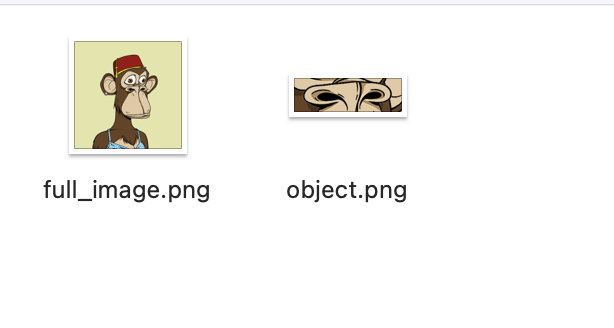
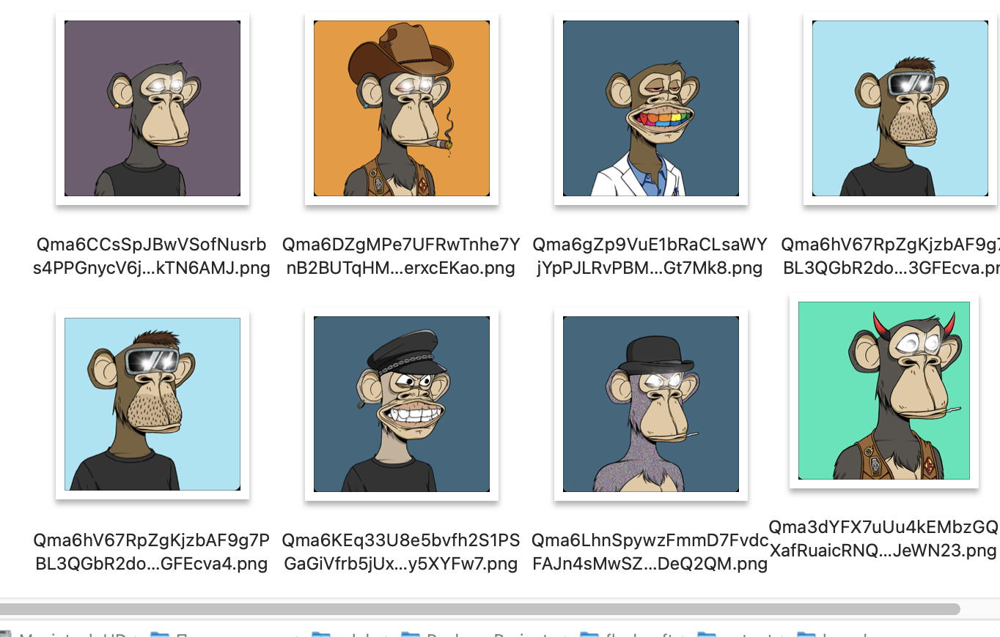
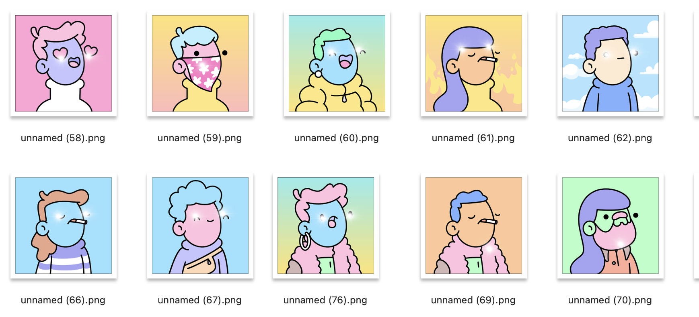
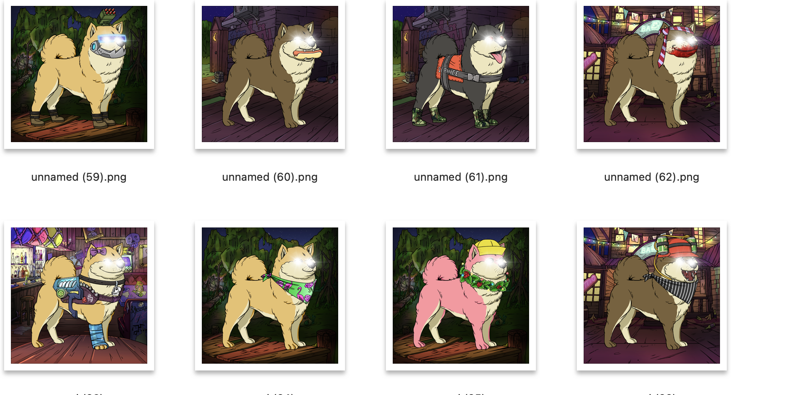

Данный алгоритм берет за основу алгоритм мэтчинга ключевых точек через SIFT после чего происходит
построение матрицы гомографии через алгоритм RANSAC. Это позволяет выполнить локализацию объекта быстро
и для этого достаточно разметки только для одной картинки.

Для работы алгоритма нужно следующие:
1. Нужно выбрать одну картинку из коллекции и на ней задать координаты мест,
в которые нужно добавить визуальный эффект. Данные координаты нужно добавить в txt файл
формате: y x
2. Нужно создать папку, в которой будут хранится два изображения. Первое изображение - это картинка,
для которой делалась разметка (её нужно назвать full_image.png). Второе изображение - это вырезанная из full_image.png,
это должна быть часть объекта, которая есть на всех объектах в коллекции (её нужно назвать object.png). 

3. После чего нужно запустить скрипт следующий командой **python main.py -c path1 -q path2 -a path3**
   * -c путь до коллекции
   * -q путь до папки, где хранятся full_image.png и object.png
   * -a путь до txt файла с аннотацией

`python main.py -c nft/bored_ape -q nft/bored_ape/query -a annotation/bored_ape.txt`

Примеры работы алгоритма:

Данный подход имеет следующие преимущества:
* Не нужно размечать много данных
* Имеет устойчивость к сдвигам объекта
* Также можно добавить устойчивость к повороту объекта
* Высокая скорость работы

Также для решения задачи были попробованы следующие подходы:
* Выделение границ изображения для того, чтобы построить ограничивающий прямоугольник и на основании его определить куда
следует добавить визуальный эффект (столкнулся с проблемой большого разброса по размеру прямоугольника)
* Применение морфологического анализа для получения остова объекта на изображение, чтобы в дальнейшем их
накладывать друг на друга и понимать куда нужно добавить визуальный эффект
* Автоматический поиск частей объекта, которые встречаются чаще всего. Проблема с тем, что мэтчинга через ключевые точки
себя показывал хуже, чем если выбрать часть объекта в ручную (в коде можно это включить).

Глубокие алгоритмы не были выбраны по причине того, что для них нужно размечать много данных. Причем разметку нужно будет делать
для каждой выбранной коллекций из-за того, что между коллекциями большой domain gap. 

